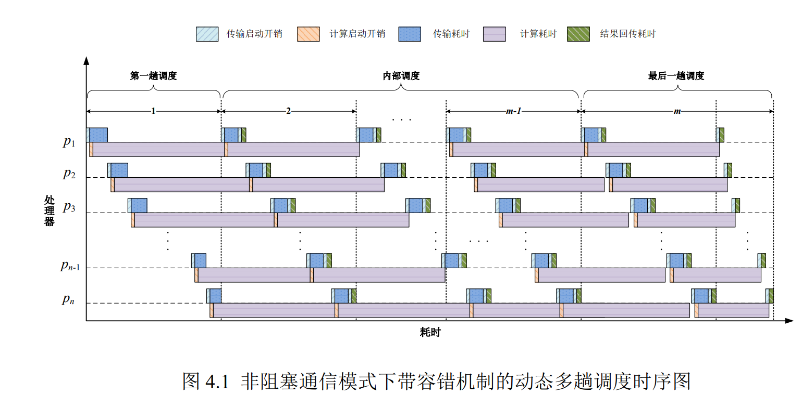
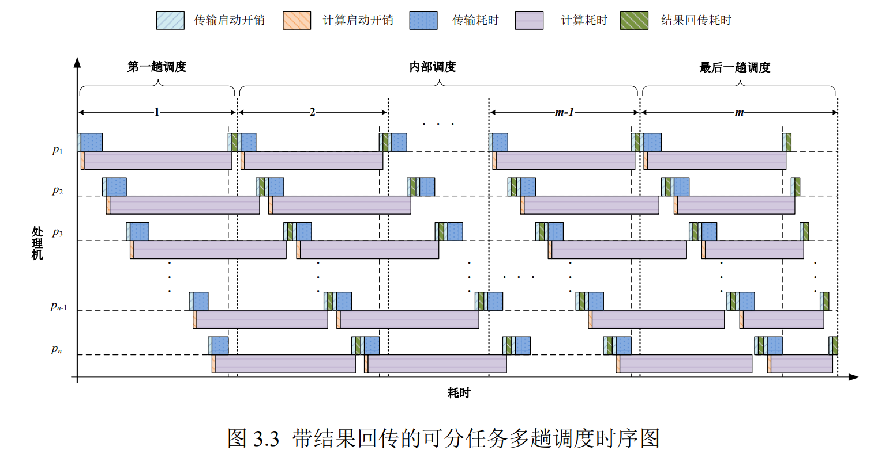

# Models

## 1 Introduction

**MISRR**：《*带容错机制的多趟调度优化模型及算法研究*》，FaDMIS（带容错机制的动态多趟调度）。

**PMIS**：《*Performance Characterization on Handling Large-Scale Partitionable Workloads on Heterogeneous Networked Compute Platforms*》，PMIS（周期性多趟调度）。

**SIS**：SIS（单趟调度）。

**myAPMISRR**：《*Theoretical Analysis of an Adaptive Periodic Multi Installment Scheduling With Result Retrieval for SAR Image Processing*》，APMISRR模型增加启动开销，去除P0的计算功能，改为非阻塞模式。

**MISRRL**：在MISRR模型中加入lambda参数调节最后一趟总任务量。

**MISRRLL**：在MISRR模型中加入lambda_1与lambda_2调节第一趟和最后一趟任务量。

## 2 Usage

1. **实例化MISRR对象**

    ```c++
    MISRR misrr(serverN, theta, m);
    ```

    serverN: 处理机数量

    theta: 结果回传比例

    m: 趟数

2. **设置调度的各项参数**

    读入`/data/`目录中的处理机各项属性（`g`、 `o`、 `s`、 `w`）：

    ```c++
    misrr.getDataFromFile();
    ```

    设置总workload：

    ```c++
    misrr.setW((double)workload);
    ```

3. **计算所需的变量值**

    ```c++
    misrr.initValue();
    ```

    `MISRR:initValue()`函数中，计算了各个所需变量：

    | 变量名  | 论文中符号 | 含义                                   |
    | ------- | ---------- | -------------------------------------- |
    | mu      | $\mu$      | 内部调度中变量（公式4.2）              |
    | eta     | $\eta$     | 内部调度中变量（公式4.2）              |
    | delta   | $\delta$   | 第一趟调度中变量（公式4.6）            |
    | phi     | $\phi$     | 第一趟调度中变量（公式4.6）            |
    | epsilon | $\epsilon$ | 第一趟调度中变量（公式4.6）            |
    | Delta   | $\Delta$   | 第一趟调度中，（公式4.6）迭代后变量    |
    | Phi     | $\Phi$     | 第一趟调度中，（公式4.6）迭代后变量    |
    | Epsilon | $\Epsilon$ | 第一趟调度中，（公式4.6）迭代后变量    |
    | lambda  | $\lambda$  | 最后一趟调度中变量（公式4.11）         |
    | psi     | $\psi$     | 最后一趟调度中变量（公式4.11）         |
    | rho     | $\rho$     | 最后一趟调度中变量（公式4.11）         |
    | Lambda  | $\Lambda$  | 最后一趟调度中，（公式4.11）迭代后变量 |
    | Psi     | $\Psi$     | 最后一趟调度中，（公式4.11）迭代后变量 |
    | Rho     | $\Rho$     | 最后一趟调度中，（公式4.11）迭代后变量 |

    若初始化`misrr`时未传入`m`，则调用`MISRR: calOptimalM()`函数，计算最优趟数`m`（公式4.35）；

    计算每趟调度的workload：

    ```c++
    this->V = this->W / this->m;
    ```

    计算各调度中的负载分量：

    ```c++
    calBeta();
    calAlpha();
    calGamma();
    ```

    | 变量名 | 论文中符号 | 含义                            |
    | ------ | ---------- | ------------------------------- |
    | beta   | $\beta$    | 内部调度负载比例（公式4.3）     |
    | alpha  | $\alpha$   | 第一趟调度负载比例（公式4.9）    |
    | gamma  | $\gamma$   | 最后一趟调度负载比例（公式4.14） |

    最后检查三个负载比例之和是否等于1。

4. **计算最优总工作时间，以及各处理机工作时间。**

    `MISRR: optimalTime()`

    `MISRR: usingTime()`

5. **处理机故障处理。**

    `MISRR: error(vector<int> &errorPlace, int errorInstallment)`
    
    分两种情况讨论：
    
    1. 若`errorInstallment == m`或`errorInstallment == m - 1`，即最后两趟中出现故障时，将重调度的开始时间设置为所有调度结束的时间，即
    
       ```c++
       this->startTime = optimalTime;
       ```
    
    2. 否则，使用算法4.1，
    
       计算重调度开始时间`startTime`，
    
       计算各处理机释放时间`busyTime`（公式4.36），
    
       获得剩余正常运行的处理机，更新`servers`，
    
       计算剩余工作量`leftW`，
    
       调用`initValue()`和`getOptimalModel()`进行重调度，
    
       计算各处理机重调度后，开始接受任务的时间`reTime`（公式4.37），
    
       计算各处理机冲突时间`codeTimeGap`为释放时间减开始时间，
    
       获取`codeTimeGap`的最大值为主处理机最优等待时间`timeGap`（公式4.38），
    
       最后的总调度时间`optimalTime` = `startTime` + `getOptimalModel()`中计算的运行时间 + `timeGap`。

## 3 Models

### MISRR

分为第一趟调度、内部调度和最后一趟调度。



- 与PMIS-RR相比，先传输本趟任务，再进行上一趟结果回传

  > （模型一）主处理机先回收处理机上一趟调度的计算结果再向处理机传输子任务块，这样会造成处理机在每两趟调度之间存在空闲等待时间。为进一步避免处理机在调度过程中的空闲等待，本章对第三章模型进行改进，（模型二）每一趟度后主处理机先传输子任务块再回收上一趟调度的计算结果。

- 目标：对任务完成时间建模，得到最优的趟数；使用动态容错算法重调度时，主处理机最优空闲等待时间。

- 4.2节，依然是需要消除第一趟与第二趟之间的空闲，减少最后一趟前的空闲；推导任务分配比例$\alpha_i,\beta_i,\gamma_i$，最后的总任务时间$T$。求$\min T(m)$，即求解最优趟数$m$。

- 4.3节，证明性质：$T$随$m$的增加，先增加后减小；进一步推导最优趟数（公式4.35）。

- 4.4节，推导主处理机的最优空闲等待时间$T_{wait}$；提出动态容错算法（算法4.1），可输出重调度方案。

  > 主处理机的最优空闲等待时间$T_{wait}$为处理机冲突时间的最大值，即故障后最后一个正常处理机的冲突时间。

- 4.5节，实验包含30台处理机，①对比PMIS-RR和DMIS-RR的任务完成时间；②重调度后冲突时间随处理机编号的变化；③对比故障情况下，PMIS-RR、DMIS-RR、SIS三个模型的任务完成时间和资源利用率

  > 处理机的冲突时间随处理机编号的增加而增大，并且最后一个处理机的冲突时间最大。因此，在数值实验上验证了4.4节中容错理论的正确性。

  > 在模型PMIS和模型SIS中，若处理机出现故障，未完成的任务量将统一在调度完成后重新分配给正常工作的处理机进行计算。

### PMIS-RR



- 分为第一趟、内部调度、最后一趟。

- 需求：消除第一趟与第二趟之间的空闲，减少最后一趟前的空闲。

- 目标：n台处理机，m趟调度，求使总工时最短的三个调度部分的任务分配比例，i.e. $\alpha_i,\beta_i,\gamma_i$。

- 3.2节进行建模，给出$\alpha_i,\beta_i,\gamma_i$的表达式，约束条件（每台处理机分配的子任务块大于 0），最后的总时间$T$的表达式。

- 3.3节设置了一些参数，推导了三台处理机的调度过程。

- 3.4节进行实验，系统包含15台处理机，设置相关参数，与PMIS、SIS模型进行对比。对比了三种模型的任务完成时间、处理机利用率。另外讨论了PMIS-RR模型中，趟数对完成时间的影响。

  > 任务完成时间随着调度趟数的增加有先减小后增加的变化趋势。
